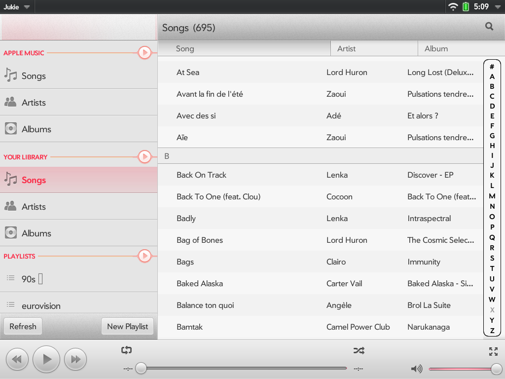
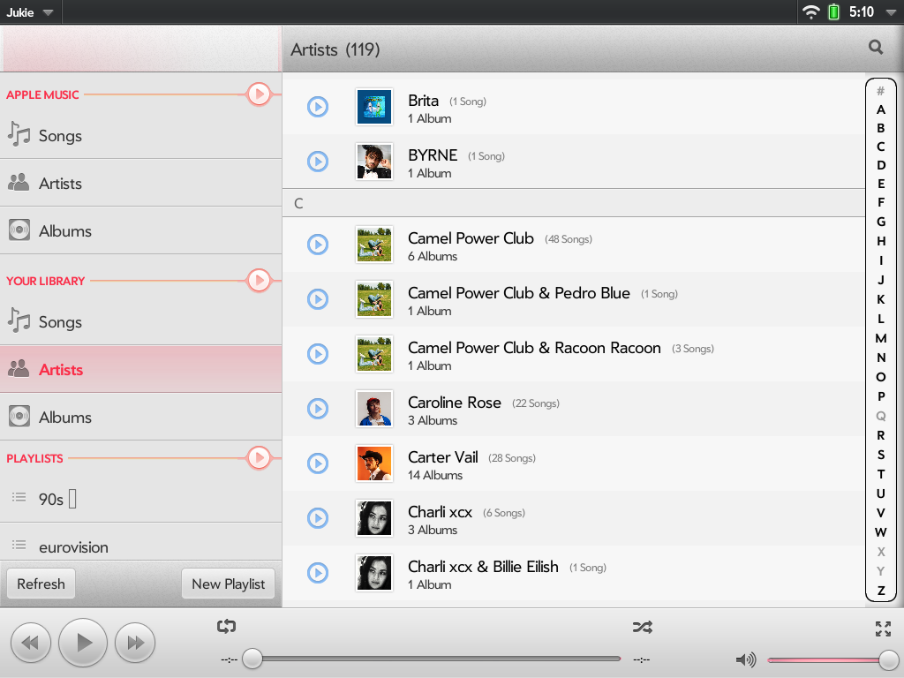
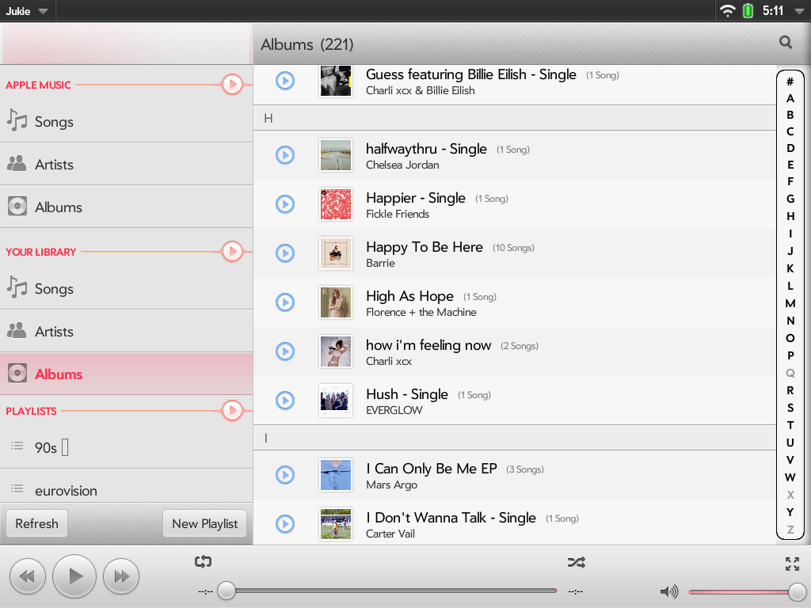
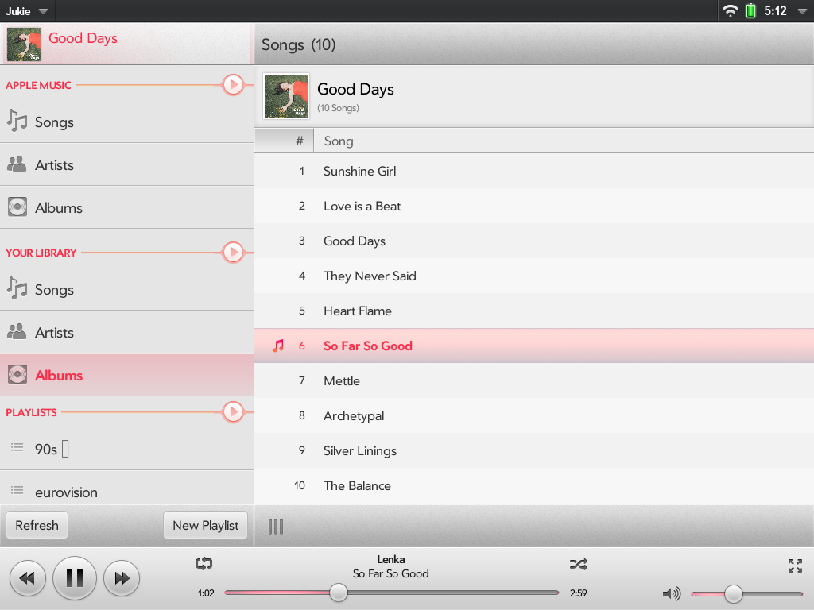
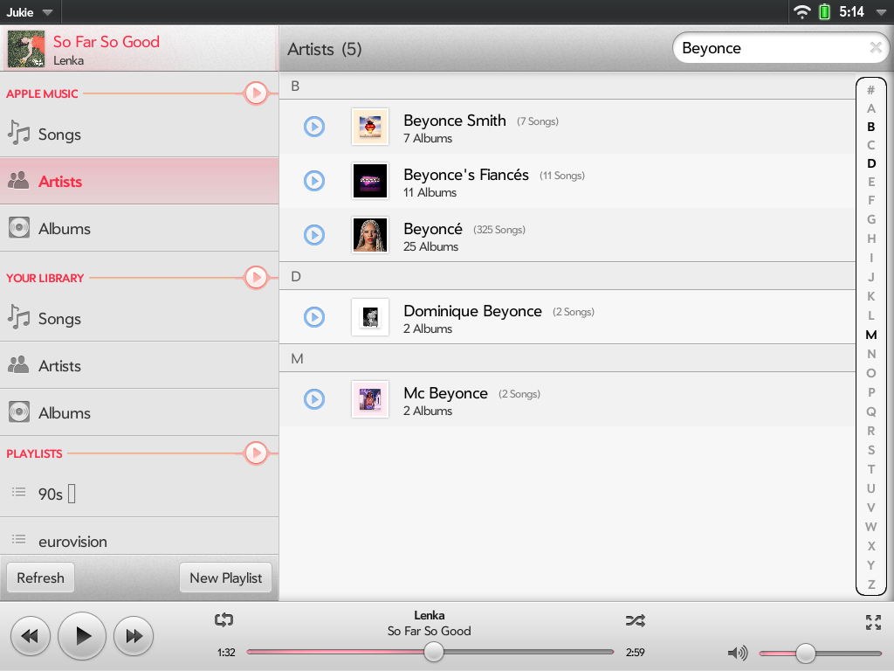
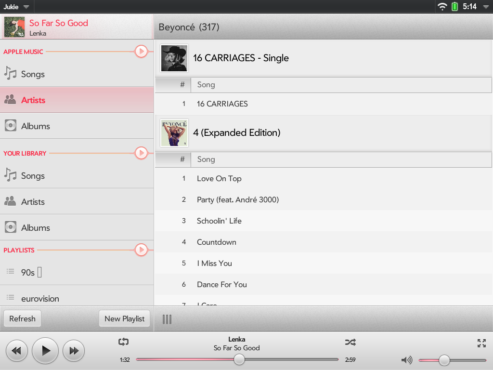
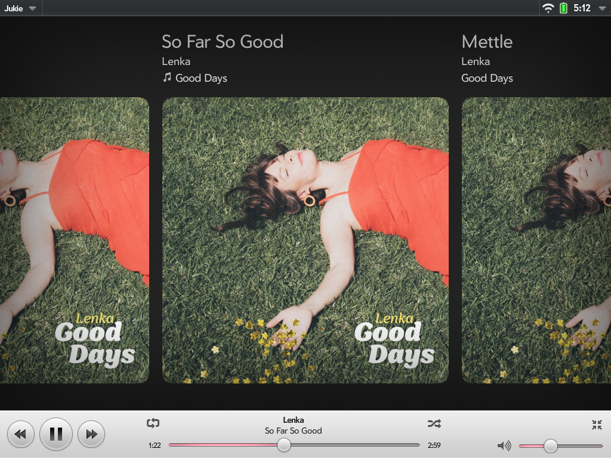
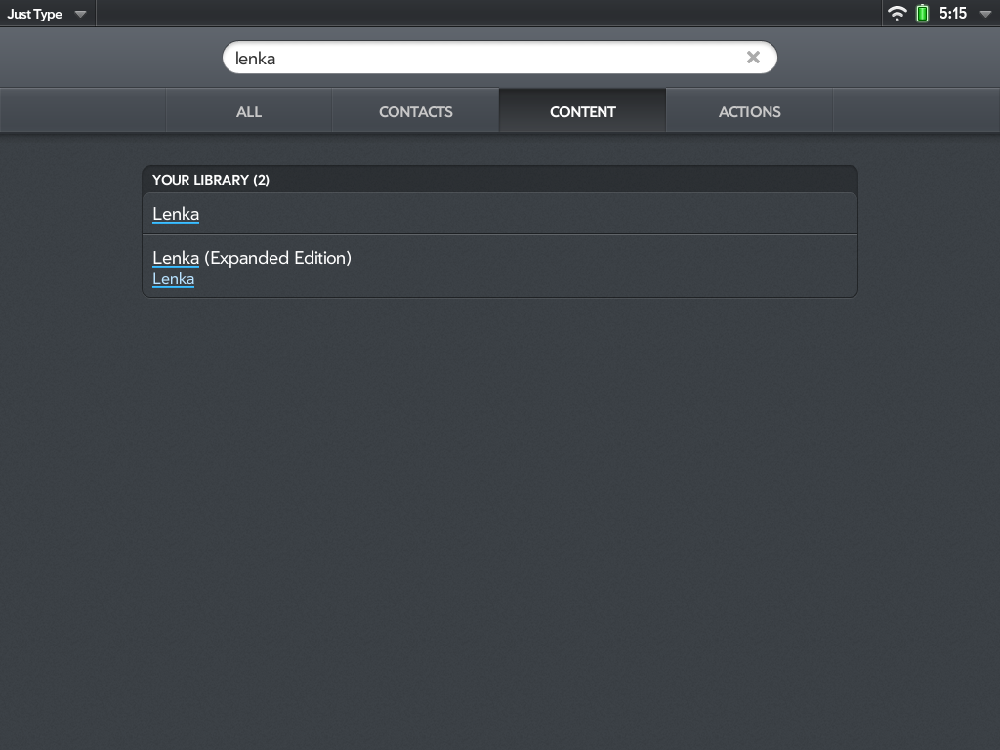
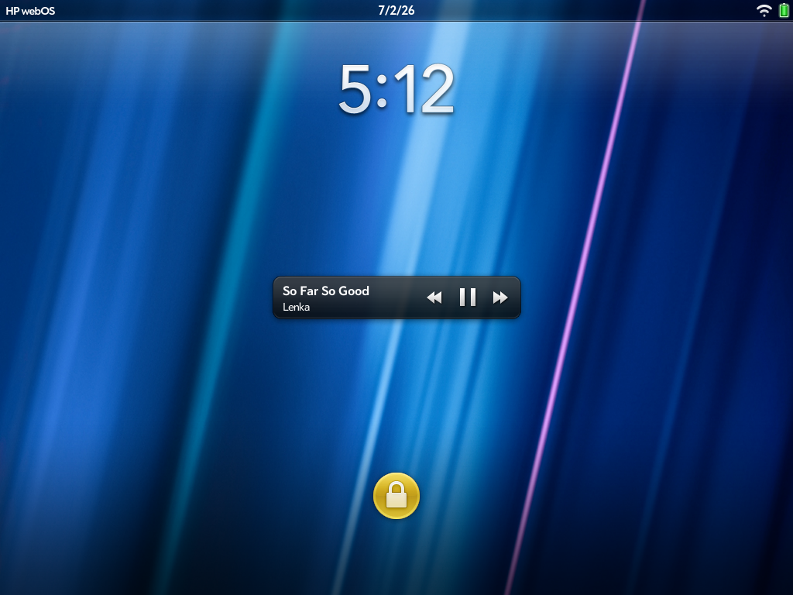
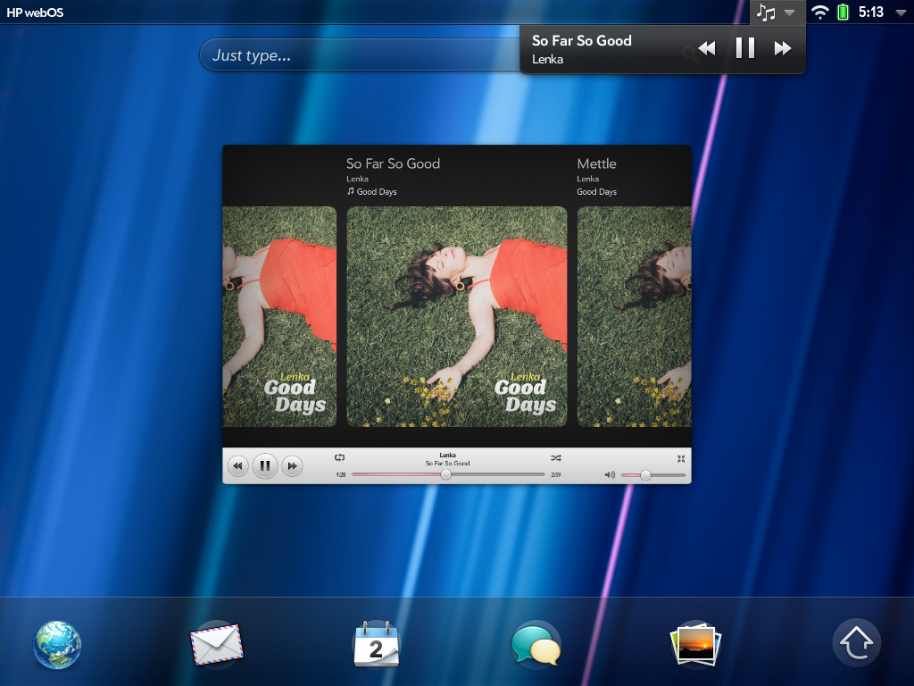

# Jukie — Features

Jukie brings Apple Music to the Palm/HP TouchPad and Pre 3, more than a decade after
these devices stopped getting updates. Here's what it can do.

## Your whole library, synced

Songs, artists, and albums from your actual Apple Music library, synced right onto the
device — with the same fast A-Z scrubber the original webOS Music app had, so jumping
to "T" in a 700-song list is one drag, not a long scroll.

Tap into an artist or album and get a clean track listing — tap any track and it starts
playing immediately, with the currently-playing song highlighted.

## The full Apple Music catalog, not just what you own

Search isn't limited to your own library — it reaches the entire Apple Music catalog.
Search for an artist and browse their complete discography, listen to anything Apple
Music has, and see full album/song counts, not just what's already in your library.

## Full tracks, not 30-second clips

This isn't a preview player — songs play in full, with a real, draggable scrubber and
accurate track lengths, just like Apple Music anywhere else.

## Now Playing, the way this device always looked best

A fullscreen, swipeable cover-art carousel for whatever's playing, with the classic
webOS card feel.

## It feels like a real webOS citizen, not a bolted-on app

Jukie hooks into the parts of webOS that make it feel native, not just another icon on
the launcher:

- **Just Type** — webOS's system-wide universal search finds songs and artists straight
  from your library, without ever opening Jukie first.

  

- **Lock screen controls** — skip, play/pause, and see what's playing without unlocking
  the device.

  

- **Status bar & dashboard** — a quick-control dropdown lives right in the status bar,
  and the Now Playing card shows up as a proper webOS dashboard, right alongside your
  other running apps.

  
